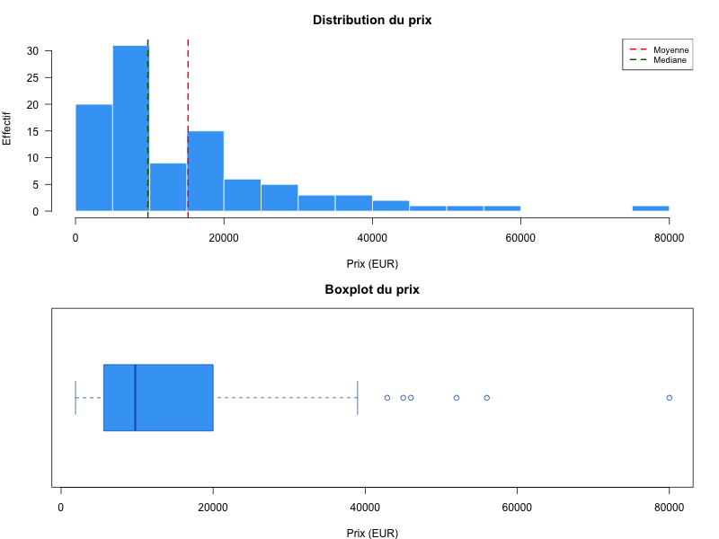
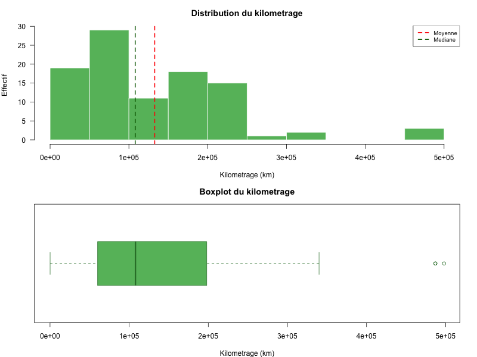
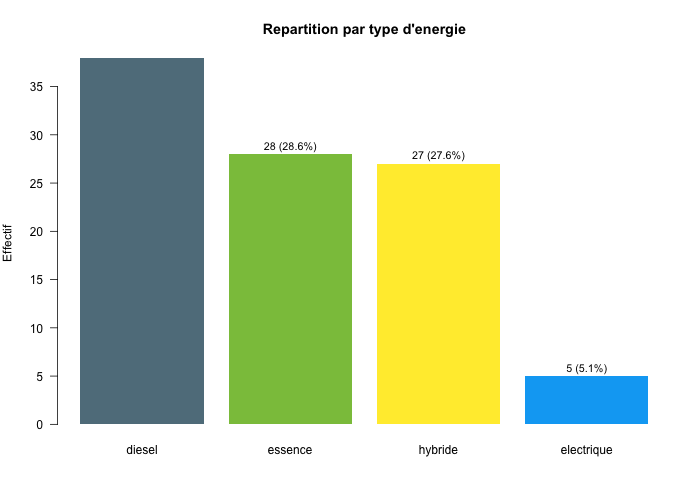
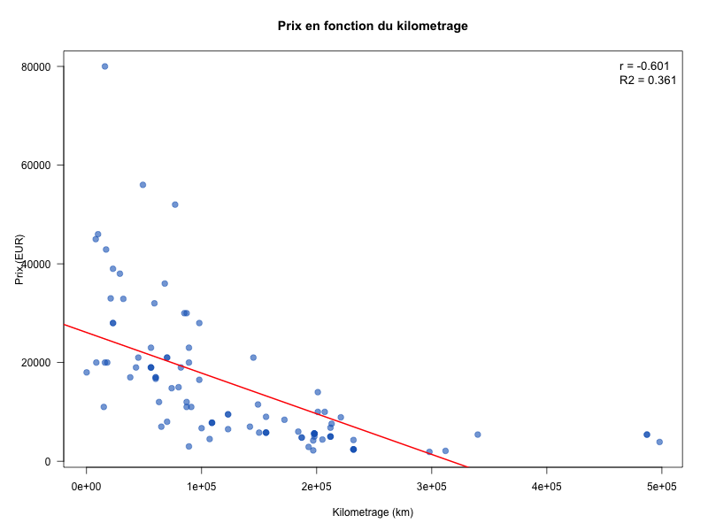
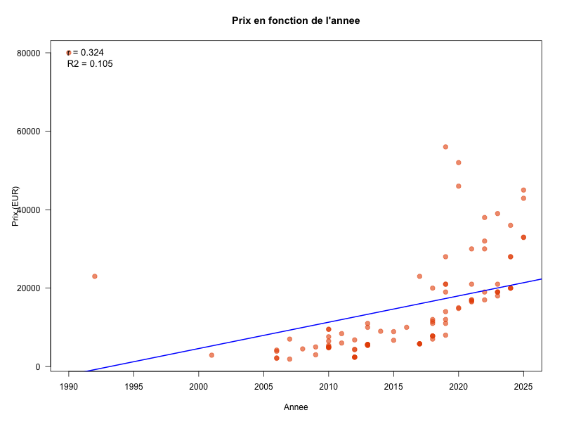
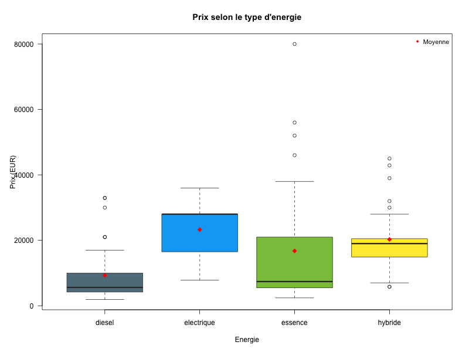
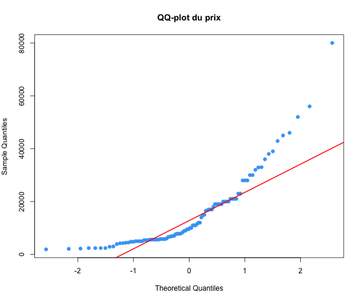
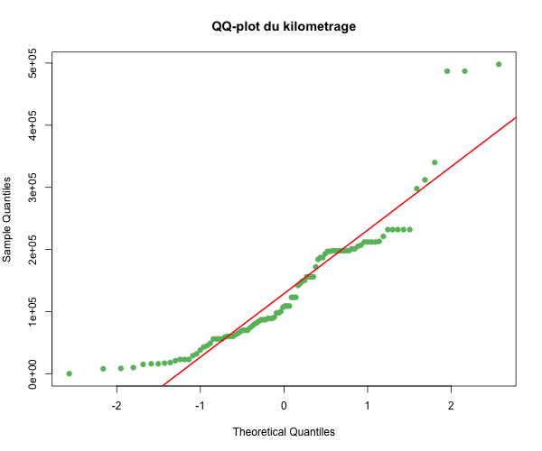
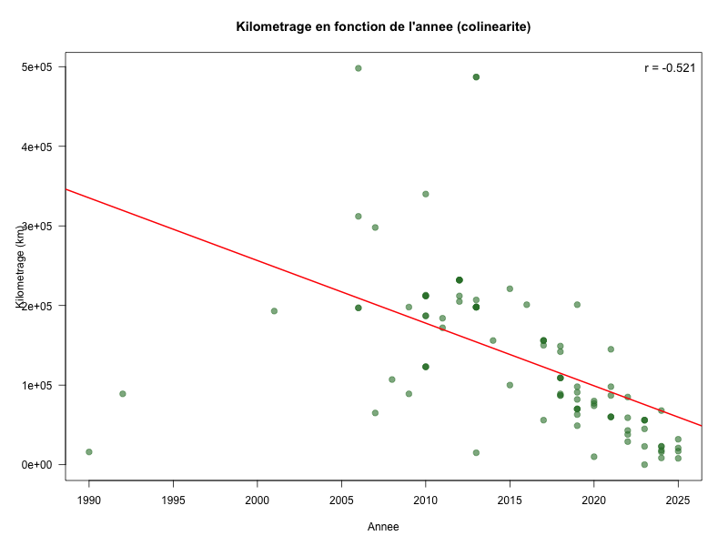

# Analyse Statistique - Voitures d'occasion

**Dataset :** `data - voitures.csv` (98 observations, 7 variables)
**Script R :** `scripts/analyse_voitures.R`

---

## 1. Statistiques descriptives univariees

### 1.1 Prix (variable quantitative)

| Statistique | Valeur |
|---|---|
| Moyenne | 15 165 EUR |
| Mediane | 9 750 EUR |
| Ecart-type | 13 835 EUR |
| CV | 91.2% |
| Min - Max | 1 900 - 80 000 EUR |
| Q1 - Q3 | 5 600 - 20 000 EUR |



**Interpretation :** La distribution du prix est **fortement asymetrique a droite** : la moyenne (15 165 EUR) est bien superieure a la mediane (9 750 EUR), ce qui signifie que quelques vehicules tres chers tirent la moyenne vers le haut. Le coefficient de variation de 91% traduit une dispersion extreme — le dataset melange des vehicules a bas prix (vieilles citadines diesel autour de 2 000 EUR) et des vehicules haut de gamme (BMW Z1 a 80 000 EUR, Toyota Supra a 56 000 EUR). La mediane est plus representative du vehicule "type" de ce dataset.

---

### 1.2 Kilometrage (variable quantitative)

| Statistique | Valeur |
|---|---|
| Moyenne | 132 764 km |
| Mediane | 108 000 km |
| Ecart-type | 100 881 km |
| CV | 76% |
| Min - Max | 100 - 498 000 km |
| Q1 - Q3 | 60 100 - 198 000 km |



**Interpretation :** Distribution egalement asymetrique a droite avec une forte dispersion (CV = 76%). On observe des extremes : un vehicule quasi-neuf (100 km, probablement une Toyota Yaris hybride 2023) et des vehicules a tres fort kilometrage (jusqu'a 498 000 km pour des Audi A2/A3 diesel). La moitie des vehicules se situe entre 60 000 et 198 000 km.

---

### 1.3 Type d'energie (variable qualitative)

| Energie | Effectif | % |
|---|---|---|
| Diesel | 38 | 38.8% |
| Essence | 28 | 28.6% |
| Hybride | 27 | 27.6% |
| Electrique | 5 | 5.1% |



**Interpretation :** Le diesel domine encore (39%), mais les motorisations hybrides representent deja 28% du parc, signe de la transition energetique en cours. L'electrique reste marginal (5 vehicules seulement).

---

## 2. Statistiques descriptives bivariees

### 2.1 Prix en fonction du kilometrage

| Indicateur | Valeur |
|---|---|
| Pearson r | -0.601 |
| R² | 0.361 |
| Equation | prix = 26 108 - 0.0824 x km |



**Interpretation :** Il existe une **relation negative nette** : plus le kilometrage augmente, plus le prix baisse. Le nuage de points montre une tendance descendante claire. Le R² de 0.36 signifie que le kilometrage seul explique 36% de la variance du prix. La pente de -0.0824 indique qu'en moyenne, **chaque tranche de 10 000 km fait baisser le prix d'environ 824 EUR**.

---

### 2.2 Prix en fonction de l'annee

| Indicateur | Valeur |
|---|---|
| Pearson r | 0.324 |
| R² | 0.105 |
| Equation | prix = -1 339 255 + 671.9 x annee |



**Interpretation :** La correlation est faible (r = 0.32) et le R² de seulement 10.5% montre que l'annee seule explique peu le prix. Le nuage de points est tres disperse : on observe notamment des vehicules anciens a prix tres eleves (BMW Z1 de 1990 a 80 000 EUR, Toyota Supra de 1992 a 23 000 EUR) qui contredisent la tendance generale. L'annee est un **mauvais predicteur du prix** comparee au kilometrage.

---

### 2.3 Prix selon le type d'energie

| Energie | n | Moyenne | Mediane | Ecart-type |
|---|---|---|---|---|
| Diesel | 38 | 9 289 | 5 600 | 8 467 |
| Electrique | 5 | 23 260 | 28 000 | 11 090 |
| Essence | 28 | 16 764 | 7 400 | 19 567 |
| Hybride | 27 | 20 278 | 19 000 | 10 130 |



**Interpretation :** Les vehicules hybrides et electriques sont en moyenne plus chers que les diesels et essences. Les diesels ont la mediane la plus basse (5 600 EUR), refletant leur anciennete et la baisse de demande. L'essence presente une tres forte dispersion (ecart-type de 19 567 EUR) a cause de vehicules de collection/sportifs.

---

## 3. Tests statistiques

### Test 1 : Correlation de Pearson — Prix x Kilometrage

**Hypotheses :**
- H0 : Il n'y a pas de correlation lineaire entre le prix et le kilometrage (r = 0)
- H1 : Il existe une correlation lineaire (r ≠ 0)
- Alpha = 0.05

**Conditions de validite :**

| Variable | Shapiro-Wilk W | p-value | Normalite |
|---|---|---|---|
| Prix | 0.8022 | < 0.001 | Rejetee |
| Kilometrage | 0.8762 | < 0.001 | Rejetee |

La normalite est rejetee pour les deux variables. Le test de Pearson est neanmoins applique car il reste robuste pour les grands echantillons (n = 98). Le test de Spearman est utilise en complement.





**Resultats :**

| Methode | Coefficient | Statistique | p-value |
|---|---|---|---|
| Pearson | r = -0.601 | t = -7.367, df = 96 | < 0.001 |
| Spearman | rho = -0.826 | — | < 0.001 |

**Conclusion :** p < 0.05 → **on rejette H0**. Il existe une correlation negative significative entre le prix et le kilometrage. Plus un vehicule a de kilometres, plus son prix baisse. Le Spearman (rho = -0.83) est plus eleve en valeur absolue que le Pearson (r = -0.60), ce qui indique une relation monotone forte mais non strictement lineaire : la decote est plus rapide pour les premiers kilometres, puis tend a se stabiliser.

---

### Test 2 : Regression multiple — Prix ~ Kilometrage + Annee

**Objectif :** Verifier si l'annee apporte une information supplementaire sur le prix, au-dela de ce que le kilometrage explique deja.

**Hypotheses :**
- H0 : Le coefficient de l'annee est nul (beta_annee = 0) quand le kilometrage est deja dans le modele
- H1 : Le coefficient de l'annee est significativement different de 0
- Alpha = 0.05

**Prerequis — colinearite kilometrage/annee :**

| Correlation | r | p-value |
|---|---|---|
| Kilometrage x Annee | -0.521 | < 0.001 |

Les vehicules plus anciens ont plus de kilometres : les deux variables portent une information en partie redondante.



**Resultats de la regression multiple :**

| Variable | Coefficient | t | p-value | Significatif ? |
|---|---|---|---|---|
| Kilometrage | -0.0813 | -6.173 | < 0.001 | **Oui** |
| Annee | +32.1 | 0.162 | **0.872** | **Non** |

| Modele | R² |
|---|---|
| prix ~ kilometrage (seul) | 0.3612 |
| prix ~ kilometrage + annee | 0.3613 |
| Gain en ajoutant l'annee | **0.0001** (quasi nul) |

**Comparaison des modeles (test F) :**
F = 0.026, p = 0.872 → le modele avec annee n'est **pas significativement meilleur**.

**Conclusion :** p = 0.872 → **on ne rejette pas H0**. L'annee n'apporte aucune information supplementaire significative sur le prix une fois le kilometrage pris en compte. Le R² n'augmente quasiment pas (de 0.3612 a 0.3613). Le kilometrage reste le seul predicteur significatif du prix.

---

## 4. Le prix depend du kilometrage mais pas de l'annee — Pourquoi ?

Le resultat le plus frappant de cette analyse est le contraste entre :
- **Prix ~ Kilometrage** : r = -0.60, p < 0.001, R² = 36% → **relation forte et significative**
- **Annee ajoutee au modele** : t = 0.16, p = 0.872, gain de R² = 0.01% → **aucun apport**

### L'explication : le kilometrage est la vraie cause, l'annee n'est qu'un intermediaire

Le prix d'un vehicule d'occasion depend de son **etat d'usure reel**, et le kilometrage en est la mesure directe. Un vehicule qui a parcouru 200 000 km a subi une usure mecanique (moteur, transmission, suspension, freins) qui reduit objectivement sa valeur, quel que soit son age.

L'annee, elle, n'a **pas d'effet direct** sur le prix. Un vehicule de 2010 avec 50 000 km peut valoir plus cher qu'un vehicule de 2018 avec 300 000 km. L'annee n'est qu'un **proxy indirect** : les vehicules plus anciens ont *generalement* plus de kilometres parce qu'ils ont roule plus longtemps. C'est ce qu'on appelle une **variable intermediaire** (ou confondante).

### La demonstration par les chiffres

```
Kilometrage et Annee sont correles : r = -0.52 (p < 0.001)
```

Cette correlation cree une **illusion** : quand on teste l'annee seule face au prix, on trouve une correlation positive (r = 0.32, p = 0.001) qui semble significative. Mais cette correlation est **artificielle** — elle n'existe que parce que les vehicules recents ont moins de kilometres.

La regression multiple le prouve : une fois qu'on connait le kilometrage d'un vehicule, savoir son annee de mise en circulation **n'aide plus du tout** a predire son prix (p = 0.872). Toute l'information utile contenue dans l'annee etait deja capturee par le kilometrage.

### Une analogie

C'est comme demander : "Qu'est-ce qui determine la fatigue d'un coureur : la distance parcourue ou le temps ecoule ?" La reponse est la distance. Le temps ecoule est correle a la distance (plus on court longtemps, plus on a parcouru), mais c'est la distance qui fatigue physiquement, pas le passage du temps.

De la meme facon, c'est le kilometrage (l'usure reelle) qui determine le prix, pas l'annee (le temps ecoule).

### Les cas qui le confirment

Le dataset contient des exemples parlants :
- **BMW Z1 (1990, 16 000 km, 80 000 EUR)** : tres ancien mais faible kilometrage → prix tres eleve (voiture de collection)
- **Toyota Supra (1992, 89 000 km, 23 000 EUR)** : 34 ans mais kilometrage modere → prix eleve
- **Audi A2 (2013, 487 000 km, 5 400 EUR)** : relativement recent mais kilometrage extreme → prix tres bas

Ces vehicules contredisent la logique "plus ancien = moins cher", mais sont parfaitement coherents avec la logique "plus de km = moins cher" (a l'exception des vehicules de collection dont la rarete prend le dessus).

---

### Code R

Le script complet est disponible dans [`scripts/analyse_voitures.R`](../scripts/analyse_voitures.R).

```bash
Rscript scripts/analyse_voitures.R
```
